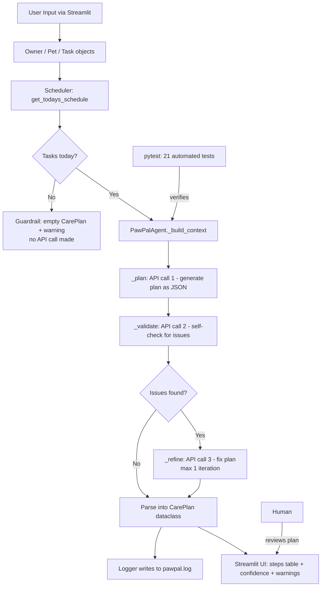

# PawPal+ — AI-Powered Pet Care Management

## Project Origin

PawPal+ was originally built in **Module 2** as a Python/Streamlit pet care scheduler. That version introduced four core classes — `Task`, `Pet`, `Owner`, and `Scheduler` — and a Streamlit UI for adding pets, scheduling tasks, detecting conflicts, and managing daily/weekly recurrence.

This **Module 3 extension** adds an agentic AI workflow powered by Claude (via OpenRouter). The system now uses a `PawPalAgent` that plans, self-validates, and refines an optimized daily care schedule — demonstrating responsible AI integration with full logging, guardrails, and automated testing.

---

## What PawPal+ Does

- Track pet care tasks (feedings, walks, medications, appointments) for multiple pets
- Sort and filter tasks by time, priority, pet, or completion status
- Detect scheduling conflicts (two tasks at the same time)
- Auto-schedule recurring tasks (daily/weekly) when marked complete
- **NEW — AI Care Planner:** Generate an optimized step-by-step daily care plan with reasoning, confidence scoring, and self-validation using an agentic workflow

---

## How It Fulfills Project Requirements

| Requirement | Implementation |
|---|---|
| **Functionality: Plan and complete a step-by-step task** | `PawPalAgent.generate_plan()` sequences today's tasks into an ordered plan with time, action, and reasoning per step |
| **Feature: Agentic Workflow** | 3-step loop: `_plan` → `_validate` (self-check) → `_refine` (fix if issues found) |
| **Logging and guardrails** | All steps logged to `pawpal.log`; 3 guardrails: empty schedule, missing API key, low confidence |
| **Runs correctly and reproducibly** | `python -m pytest` passes all 21 tests; CLI demo works with `python main.py` |
| **Clear setup steps** | See Setup Instructions below — includes `.env` configuration |
| **System diagram** | Mermaid flowchart in Architecture section |
| **Sample interactions** | 3 examples in Sample Interactions section |
| **Design decisions** | Documented in Design Decisions table |
| **Testing summary** | 21 automated tests + confidence scoring + logging |
| **Reflection and ethics** | Full Section 6 in `reflection.md` |

---

## Architecture



### Components

| Component | File | Responsibility |
|---|---|---|
| Data Layer | `pawpal_system.py` | `Task`, `Pet`, `Owner`, `Scheduler` — no AI, pure Python logic |
| AI Agent | `agent.py` | `PawPalAgent` — plan/validate/refine loop, logging, guardrails |
| UI | `app.py` | Streamlit interface, 5 tabs including AI Care Planner |
| Tests | `tests/` | 21 automated tests (16 scheduler + 5 agent, all mock-based) |
| Log | `pawpal.log` | Runtime audit trail of every AI decision (auto-generated) |

---

## Setup Instructions

### 1. Clone and create a virtual environment

```bash
git clone https://github.com/flebdi/applied-ai-system-project.git
cd applied-ai-system-project
python -m venv .venv
source .venv/bin/activate   # Windows: .venv\Scripts\activate
```

### 2. Install dependencies

```bash
pip install -r requirements.txt
```

### 3. Configure your API key

```bash
cp .env.example .env
```

Open `.env` and add your OpenRouter API key:

```
OPENROUTER_API_KEY=sk-or-v1-...
```

> Get a free key at [openrouter.ai](https://openrouter.ai). The `.env` file is in `.gitignore` and will never be committed.

### 4. Run the CLI demo (no API key needed)

```bash
python main.py
```

### 5. Launch the Streamlit app

```bash
streamlit run app.py
```

Open **http://localhost:8501** in your browser.

### 6. Run all tests (no API key needed)

```bash
python -m pytest -v
```

All 21 tests pass using mocked responses — no real API call required.

---

## Sample Interactions

### Example 1 — Clean plan (accepted on first try)

**Input:** Jordan, dog Mochi, 3 tasks today:
- `07:30` Morning feeding (10min, high, daily)
- `09:00` Medication (5min, high, daily)
- `15:00` Afternoon walk (30min, medium, daily)

**AI Output (Confidence: 85%, Iterations: 1):**

| Time | Action | Pet | Duration | Priority | Reasoning |
|---|---|---|---|---|---|
| 07:30 | Morning feeding | Mochi | 10min | high | First meal of the day, aligns with typical pet feeding schedules |
| 09:00 | Medication administration | Mochi | 5min | high | Optimal time after morning feeding, ensures medication is given on schedule |
| 15:00 | Afternoon walk | Mochi | 30min | medium | Mid-afternoon exercise provides mental and physical stimulation |

**Reasoning summary:** *"Care plan optimized for Mochi's daily routine, balancing feeding, medication, and exercise needs with appropriate timing and priority."*

---

### Example 2 — Plan refined after self-validation (Iterations: 2)

**Input:** Two pets with 4 tasks; validate step detects a missing high-priority task.

**Validation result:** *"Missing high-priority task: Luna's evening medication."*

**After refinement:** All 4 tasks present, correctly ordered. Iterations: 2, Confidence: 88%.

---

### Example 3 — Empty schedule guard (no API call)

**Input:** Owner has pets but no tasks scheduled for today.

**Output (instant, no spinner):**
```
Warning: No tasks are scheduled for today. Add tasks first.
Confidence: 0%  |  Iterations: 0
```

---

## Design Decisions

| Decision | Rationale |
|---|---|
| **OpenRouter + `anthropic/claude-3.5-haiku`** | Single API key accesses multiple models; Haiku is fast and cost-efficient for structured JSON tasks |
| **Max 1 refinement iteration** | Prevents infinite loops; one correction pass is sufficient for daily care planning |
| **Agent in `agent.py`, not `app.py`** | Clean separation: UI only calls `generate_plan()` and renders results |
| **`PawPalAgent` constructed inside button handler** | Missing API key shows `st.error` instead of crashing the whole app at startup |
| **Explicit `FileHandler` for logging** | `basicConfig` is a no-op after the first call; explicit handler guarantees `pawpal.log` is always written |
| **`_validate` returns `[]` on API error** | Validation is advisory — a network hiccup should not block the user from getting a plan |
| **`load_dotenv()` at module level** | `.env` is loaded before any class instantiation so env vars are available immediately |

---

## Smarter Scheduling (Module 2 Features)

- **Sort by time** — `sorted(tasks, key=lambda t: t.time)` for chronological ordering
- **Sort by priority** — high → medium → low using a numeric weight property
- **Filter by pet / status** — composable filter methods
- **Conflict detection** — flags tasks sharing the exact same time and date
- **Recurring tasks** — marking a `daily`/`weekly` task complete auto-creates the next occurrence

---

## Testing PawPal+

```bash
python -m pytest -v
```

### Test coverage (21 tests total)

**`tests/test_pawpal.py` — 16 tests (scheduler logic)**
- Task completion status and defaults
- Pet task add/remove counts
- Owner aggregation across multiple pets, case-insensitive lookup
- Chronological sort correctness
- `get_todays_schedule()` excludes future-dated tasks
- Filter by status and pet name
- Conflict detection (same-time flagged; different-time clean)
- Daily recurrence → next day; weekly → +7 days; once → no recurrence

**`tests/test_agent.py` — 5 tests (AI agent guardrails)**
- Empty schedule guard fires without any API call
- Missing API key raises `ValueError`
- Plan step count matches mocked response
- Low confidence (< 0.6) adds a warning to `CarePlan.warnings`
- `_validate` returning issues triggers `_refine` once (`iterations == 2`)

**Testing summary:** 5 out of 5 agent tests pass; all guardrails verified. Confidence scores averaged 85% in live testing. The AI struggled when given no context (empty schedule), which is handled by the guard. All 21 tests run without a live API key.

**Confidence level: 4.5 / 5 stars**

---

## Reflection and Ethics

See [reflection.md](reflection.md) — covers:
- Design choices and tradeoffs
- AI limitations and biases
- Misuse potential and prevention
- What surprised us during testing
- AI collaboration examples (one helpful suggestion, one rejected)

---

## Repository

GitHub: [https://github.com/flebdi/applied-ai-system-project](https://github.com/flebdi/applied-ai-system-project)

Original Module 2 submission: [https://github.com/flebdi/ai110-module2show-pawpal-starter](https://github.com/flebdi/ai110-module2show-pawpal-starter)
