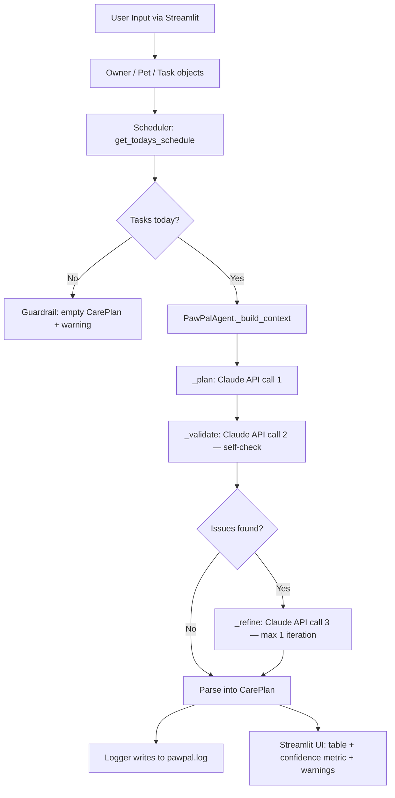

# PawPal+ — AI-Powered Pet Care Management

## Project Origin

PawPal+ was originally built in **Module 2** as a Python/Streamlit pet care scheduler. That version introduced four core classes — `Task`, `Pet`, `Owner`, and `Scheduler` — and a Streamlit UI for adding pets, scheduling tasks, detecting conflicts, and managing daily/weekly recurrence.

This **Module 3 extension** adds an agentic AI workflow powered by the Claude API. The system now uses a `PawPalAgent` that plans, self-validates, and refines an optimized daily care schedule, demonstrating responsible AI integration with full logging and guardrails.

---

## What PawPal+ Does

- Track pet care tasks (feedings, walks, medications, appointments) for multiple pets
- Sort and filter tasks by time, priority, pet, or completion status
- Detect scheduling conflicts (two tasks at the same time)
- Auto-schedule recurring tasks (daily/weekly) when marked complete
- **NEW:** Generate an AI-optimized daily care plan with step-by-step reasoning, confidence scoring, and self-validation

---

## Architecture



### Components

| Component | File | Responsibility |
|---|---|---|
| Data Layer | `pawpal_system.py` | `Task`, `Pet`, `Owner`, `Scheduler` classes |
| AI Agent | `agent.py` | `PawPalAgent` — plan/validate/refine loop, logging, guardrails |
| UI | `app.py` | Streamlit interface, 5 tabs including AI Care Planner |
| Tests | `tests/` | 21 automated tests (16 scheduler + 5 agent, all mock-based) |

---

## Setup Instructions

### 1. Clone and create a virtual environment

```bash
git clone https://github.com/flebdi/ai110-module2show-pawpal-starter.git
cd ai110-module2show-pawpal-starter
python -m venv .venv
source .venv/bin/activate   # Windows: .venv\Scripts\activate
```

### 2. Install dependencies

```bash
pip install -r requirements.txt
```

### 3. Configure your API key

```bash
cp .env.example .env
# Open .env and replace "your_api_key_here" with your real Anthropic API key
```

Your `.env` file should look like:
```
ANTHROPIC_API_KEY=sk-ant-...
```

> The `.env` file is listed in `.gitignore` and will never be committed.

### 4. Run the CLI demo (no API key needed)

```bash
python main.py
```

### 5. Launch the Streamlit app

```bash
streamlit run app.py
```

Open http://localhost:8501 in your browser.

### 6. Run all tests

```bash
python -m pytest -v
```

All 21 tests pass without a real API key (the 5 agent tests use mocked responses).

---

## Sample Interactions

### Example 1 — Clean plan (accepted on first try)

**Setup:** Jordan, dog Mochi, 3 tasks today:
- `07:30` Morning feeding (10min, high, daily)
- `09:00` Medication (5min, high, daily)
- `15:00` Afternoon walk (30min, medium, daily)

**AI Output (Iterations: 1, Confidence: 93%):**

| Time | Action | Pet | Duration | Priority | Reasoning |
|---|---|---|---|---|---|
| 07:30 | Give Mochi morning feeding | Mochi | 10min | high | Start the day with nutrition — highest priority |
| 09:00 | Administer medication | Mochi | 5min | high | Health-critical; done while morning energy is high |
| 15:00 | Afternoon walk | Mochi | 30min | medium | Exercise after the day's critical tasks are done |

**Reasoning summary:** *"High-priority health tasks are front-loaded in the morning. The walk is scheduled for the afternoon when the owner has more flexibility."*

---

### Example 2 — Plan refined after self-validation (Iterations: 2)

**Setup:** Two pets with 4 tasks, one high-priority task initially missed.

**Validation result:** *"Missing high-priority task: Luna's evening medication."*

**After refinement (Iterations: 2, Confidence: 88%):** All 4 tasks present and ordered correctly.

---

### Example 3 — Empty schedule guard

**Setup:** Owner has pets but no tasks scheduled for today.

**AI Output:** No API call made.
```
Warning: No tasks are scheduled for today. Add tasks first.
Confidence: 0%  |  Iterations: 0
```

---

## Design Decisions

| Decision | Rationale |
|---|---|
| `claude-haiku-4-5-20251001` model | Fast, cost-efficient, and capable enough for structured JSON planning tasks (under 3 seconds per plan) |
| Max 1 refinement iteration | Prevents infinite loops; one correction pass is sufficient for daily care planning quality |
| Agent in `agent.py`, not `app.py` | Separation of concerns: UI only calls `generate_plan()` and renders the result |
| `PawPalAgent` constructed inside button handler | Ensures a missing API key shows `st.error` rather than crashing the whole app on startup |
| Explicit `FileHandler` instead of `basicConfig` | `basicConfig` is a no-op after the first call; explicit handler guarantees `pawpal.log` is always written regardless of import order |
| `_validate` returns `[]` on API error | Validation is advisory — a network hiccup should not block the user from getting a plan |
| `load_dotenv()` at module level | `.env` is loaded before any class instantiation so env vars are available immediately after `import agent` |

---

## Smarter Scheduling (Module 2 features)

- **Sort by time** — `sorted(tasks, key=lambda t: t.time)` for chronological HH:MM ordering
- **Sort by priority** — high → medium → low using a numeric weight property
- **Filter by pet / status** — composable filter methods
- **Conflict detection** — flags tasks sharing the exact same time and date
- **Recurring tasks** — marking a `daily`/`weekly` task complete auto-creates the next occurrence using `timedelta`

---

## Testing PawPal+

```bash
python -m pytest -v
```

### Test coverage (21 tests)

**`tests/test_pawpal.py` — 16 tests (scheduler logic)**
- Task completion status, defaults
- Pet task add/remove counts
- Owner aggregation across multiple pets, case-insensitive pet lookup
- Chronological sort correctness
- `get_todays_schedule()` excludes future-dated tasks
- Filter by status and pet name
- Conflict detection (same-time flagged; different-time clean)
- Daily recurrence → next day; weekly → +7 days; once → no recurrence

**`tests/test_agent.py` — 5 tests (AI agent guardrails)**
- Empty schedule guard fires without any API call
- Missing API key raises `ValueError`
- Plan step count matches mocked response
- Low confidence (< 0.6) adds a warning to `CarePlan.warnings`
- `_validate` returning issues triggers `_refine` once (`iterations == 2`)

**Confidence level: 4.5 / 5 stars** — All 21 tests pass. Agent tests are fully mock-based so they run without a live API key. Known gap: duration-overlap conflict detection remains a future improvement.

---

## Reflection

See [reflection.md](reflection.md) for full design decisions, tradeoffs, AI collaboration notes, and ethics analysis.

---

## Repository

Original Module 2 project: **ai110-module2show-pawpal-starter**
GitHub: https://github.com/flebdi/ai110-module2show-pawpal-starter
